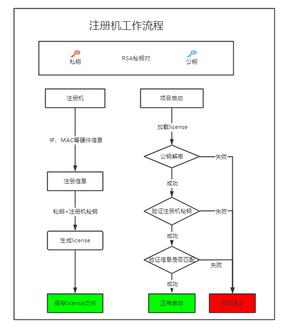

# license

java项目本地部署，项目授权后方能使用

## 工作流程图

## 项目结构

    --license-core 核心包依赖
    --license-example 项目引用示例
    --register-machine 注册机用于生成许可证

项目支持ip绑定，可以后期进行自定义拓展，支持其他硬件数显绑定

## 模块介绍

### license-core

**项目核心依赖，对license进行校验校验**

CoreVerification-核心校验校验类，对硬件参数进行校验

RsaUtil - 非对称加密工具，可生成RSA秘钥对

### license-example

**简单demo示例**

1.引入license-core maven依赖

2.调用LicenseProcess.start方法即可使用

注：LicenseProperties-属性配置，仅需指定公钥路径、license路径、
注册机签名秘钥 **（注册机生成license时指定的秘钥，防止本地公钥被其他公钥替换）**

与springboot整合是可将配置信息放入yaml中进行管理，容器初始化后
调用LicenseProcess.start

### register-machine

**注册机，用于license生成**

